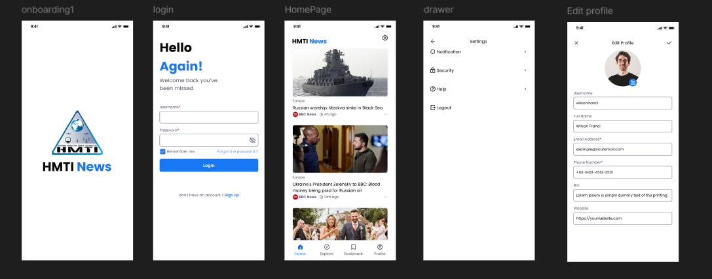
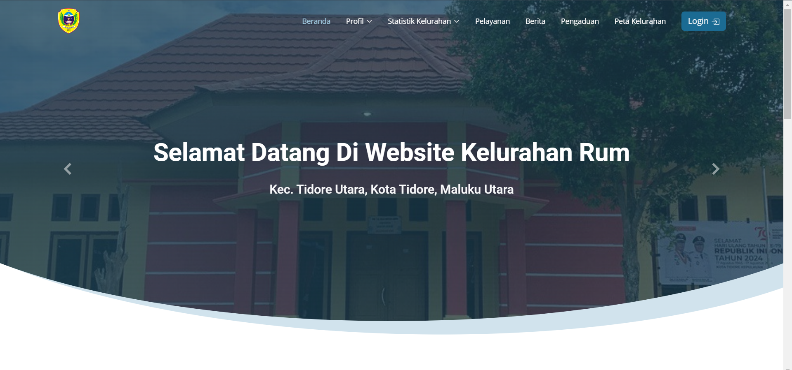
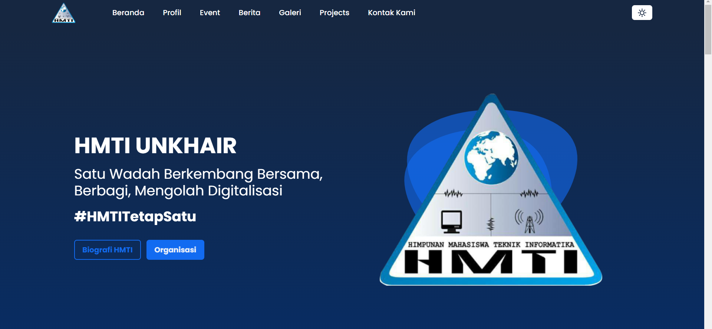

# 👋 Hello, I'm Wahyu Jihad Umaternate

## 🎓 IT Enthusiast
Hi! My name is **Wahyu Jihad Umaternate**, and you can call me Wahyu. I am a student of Informatics Engineering at Khairun University. I have expertise in web development and a passion for continuous learning.

### 🌟 About Me
I am well-versed in using Laravel, and my current goal is to enhance my skills as I pursue a professional career in Software Engineering, contributing to impactful projects and solutions.

---

## 🏆 GitHub Stats

---

## 🛠️ My Awesome Services
### Website Development
- **Projects Completed**: 10+

### Mobile App Development
- **Projects Completed**: 1+

---

## 📂 My Portfolio
Here are some of the projects I've worked on:

1. **HMTI News App**  
   

2. **Website Kelurahan**  
   

3. **Website HMTI**  
   

---

## 📞 Want to Make Awesome and Impactful Products?
Feel free to reach out to me!  
📧 [Contact Me](mailto:wahyuumaternate@protonmail.com)

---

## 🌐 Follow Me
- [Instagram](https://www.instagram.com/wahyu.umaternate15?igsh=MW5wcXBudjhjaXo2bw%3D%3D&utm_source=qr)
- [LinkedIn](https://www.linkedin.com/in/wahyu-umaternate-108164288/?locale=in_ID)
- [Twitter](#)

---

Thank you for visiting my profile! I'm excited to connect and collaborate on exciting projects. 😊
